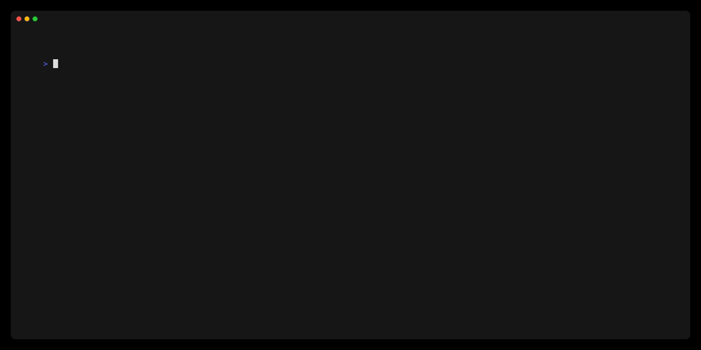

# :rocket: atmos.nvim

A Neovim plugin that enables efficient navigation and management of Atmos stacks and components directly within your Neovim environment.

---

<p align="center">

</p>

## :question: What is Atmos?

Atmos is a powerful infrastructure-as-code (IaC) tool that simplifies the management of cloud resources across multiple environments. It introduces two key concepts:

1. **Stacks**: Configuration blueprints that describe a cohesive collection of components. Stacks automate the deployment, management, and teardown of Terraform resources, ensuring uniform setups across different environments (e.g., `development`, `staging`, `production`).

2. **Components**: The building blocks of your infrastructure. Components define the business logic for provisioning common pieces of infrastructure, such as ECR repositories or EKS clusters.

This plugin enhances your Atmos workflow by providing quick and easy navigation of your Atmos stacks and components within Neovim.

## :exclamation: Features

- List and navigate Atmos stacks and components using Telescope
- Validate Atmos stacks directly from Neovim
- Quick access to stack and component definitions
- Seamless integration with your existing Neovim setup

## Requirements

> [!IMPORTANT]
>
> - Neovim 0.8 or later
> - [Telescope.nvim](https://github.com/nvim-telescope/telescope.nvim)
> - [Atmos](https://atmos.tools/install/) installed and configured in your system

## Installation

Using [packer.nvim](https://github.com/wbthomason/packer.nvim):

```lua
use {
  'RoseSecurity/atmos.nvim',
  requires = {'nvim-telescope/telescope.nvim'}
}
```

Using [vim-plug](https://github.com/junegunn/vim-plug):

```sh
Plug 'nvim-telescope/telescope.nvim'
Plug 'RoseSecurity/atmos.nvim'
```

For other package managers, please refer to their respective documentation for adding plugins.

## Setup

Add the following to your Neovim configuration:

```lua
require("atmos").setup({
  base_path = "<ATMOS_BASE_PATH>",
  config_path = "<ATMOS_CLI_CONFIG>"
})
```

These correspond to the `ATMOS_CLI_CONFIG_PATH` environment variable, which is where to find `atmos.yaml`. It's the path to a folder where `atmos.yaml` CLI config file is located. The `ATMOS_BASE_PATH` is the base path to components and stacks folders.

## Usage

The plugin provides two main commands:

1. `:AtmosListStacks`
   - Opens a Telescope picker listing all available Atmos stacks

2. `:AtmosListComponents`
   - Opens a Telescope picker listing all available Atmos components
   - Selecting a component will navigate you to the component directory

3. `:AtmosValidateStacks`
   - Validate Atmos stack manifest configurations


You can map these commands to key bindings for quicker access. For example:

```lua
vim.api.nvim_set_keymap('n', '<leader>as', ':AtmosListStacks<CR>', { noremap = true, silent = true })
vim.api.nvim_set_keymap('n', '<leader>ac', ':AtmosListComponents<CR>', { noremap = true, silent = true })
vim.api.nvim_set_keymap('n', '<leader>av', ':AtmosValidateStacks<CR>', { noremap = true, silent = true })
```
